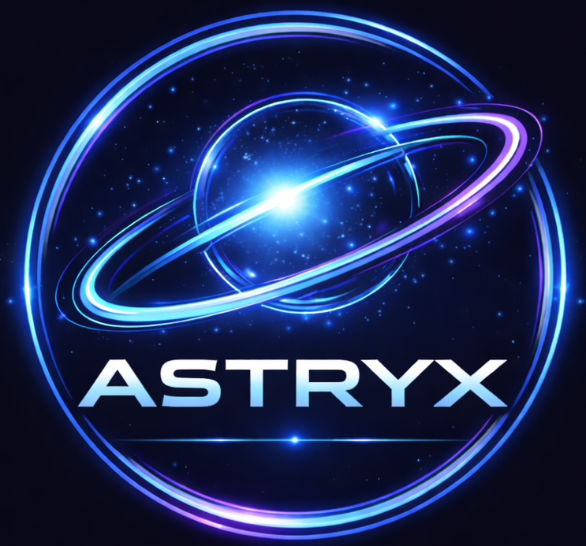

<div align="center">



# ASTERYX AI

**A fully offline, privacy-first AI assistant powered by Llama 3 and Ollama.**  
No cloud. No telemetry. No compromise.


[Features](#-features) · [Installation](#-installation) · [Usage](#-usage) · [Project Structure](#-project-structure) · [Contributing](#-contributing)

</div>

---

## 🚀 Overview

ASTERYX is a self-hosted AI chat application that runs entirely on your local machine. It connects to [Ollama](https://ollama.ai) to serve large language models — meaning your conversations are never sent to any external server.

Built with a clean **Node.js + Express** backend and a polished multi-page frontend featuring dark/light mode, accent color theming, keyboard shortcuts, toast notifications, mobile responsiveness, and animated page transitions.

---

## ✨ Features

### 🤖 AI & Chat
- Powered by **Llama 3** via Ollama — runs 100% offline
- Multi-session chat with conversation history
- Typing animation for bot responses
- One-click copy on any message
- Delete individual conversations

### 🎨 UI & Experience
- **Dark / Light mode** toggle — persists across all pages
- **8 accent color presets** + custom color picker
- **Animated page transitions** — smooth fade between pages
- **Toast notifications** — for actions, errors, and confirmations
- **Keyboard shortcuts** — `Ctrl+K`, `Ctrl+D`, `Ctrl+/`, `Ctrl+P`
- **Mobile responsive** sidebar with hamburger menu
- **Loading skeletons** on form submissions
- **Password strength meter** on signup

### 🔐 Auth & Security
- Session-based authentication with `express-session`
- Protected routes — chat is inaccessible without login
- HTML pages served only through server routes (never as static files)
- Signup → Login → Chat flow enforced server-side

---

## 🛠 Tech Stack

| Layer | Technology |
|---|---|
| Runtime | Node.js 18+ |
| Web Framework | Express 5 |
| AI Backend | Ollama (Llama 3) |
| Auth | express-session |
| HTTP Client | Axios |
| Frontend | Vanilla HTML / CSS / JS |
| Data Store | JSON file (`users.json`) |

---

## 📦 Installation

### Prerequisites

- [Node.js](https://nodejs.org) v18 or higher
- [Ollama](https://ollama.ai) installed and running
- Llama 3 model pulled

### 1. Clone the repository

```bash
git clone https://github.com/your-username/asteryx-ai.git
cd asteryx-ai
```

### 2. Install dependencies

```bash
npm install
```

### 3. Pull the Llama 3 model

```bash
ollama pull llama3
```

### 4. Start Ollama

```bash
ollama serve
```

> Ollama runs on `http://localhost:11434` by default.

### 5. Start ASTERYX

```bash
node server.js
```

### 6. Open in browser

```
http://localhost:3000
```

---

## 📁 Project Structure

```
asteryx-ai/
├── server.js           # Express server — all routes & API
├── users.json          # User accounts (auto-managed)
├── package.json
│
├── public/             # Static assets (served publicly)
│   ├── logo.png
│   ├── founder.jpg
│   └── ui.js           # Shared UI library (toast, theme, shortcuts, etc.)
│
└── views/              # HTML pages (served only via server routes)
    ├── landing.html    # Public landing page
    ├── login.html      # Login form
    ├── signup.html     # Signup form
    └── index.html      # Protected chat interface
```

> ⚠️ The `views/` folder is **not** exposed as static files. All HTML is served through authenticated routes in `server.js` — so pages like `/login` can't be bypassed by visiting `login.html` directly.

---

## 🔑 Page Flow

```
/ (Landing)
    ↓
/signup  or  /login
    ↓
/chat  ← requires active session
    ↓
/logout → back to /
```

- Visiting `/chat` without a session → redirects to `/`
- Visiting any `.html` file directly → redirects to `/`
- Already logged in and visiting `/login` → skips to `/chat`

---

## ⌨️ Keyboard Shortcuts

| Shortcut | Action |
|---|---|
| `Ctrl + K` | New conversation |
| `Ctrl + D` | Toggle dark / light mode |
| `Ctrl + P` | Open accent color picker |
| `Ctrl + /` | Show all keyboard shortcuts |
| `Enter` | Send message |
| `Shift + Enter` | New line in message |
| `Esc` | Close any open panel |

---

## ⚙️ Configuration

All configuration lives in `server.js`. Key values to update:

```js
// Session secret — change to a long random string in production
secret: "astryx-secret"

// Ollama model — swap for any model you have pulled
model: "llama3"

// Ollama endpoint — change if running on a different host/port
"http://127.0.0.1:11434/api/generate"

// Server port
app.listen(3000, ...)
```

### Switching AI models

Pull any model via Ollama and update `server.js`:

```bash
ollama pull mistral
ollama pull codellama
ollama pull phi3
```

Then in `server.js`:

```js
model: "mistral"   // or codellama, phi3, gemma, etc.
```

---

## 🔒 Security Notes

> This project is designed for **local / personal use**. Before deploying publicly, consider these improvements:

- **Hash passwords** — currently stored as plain text. Use `bcrypt`.
- **Use a real database** — replace `users.json` with SQLite, PostgreSQL, or MongoDB.
- **Environment variables** — move secrets to a `.env` file using `dotenv`.
- **HTTPS** — add SSL via a reverse proxy (Nginx + Let's Encrypt) for production.
- **Rate limiting** — add `express-rate-limit` to protect `/login` from brute force.

---

## 🤝 Contributing

Contributions are welcome! Feel free to open issues or pull requests.

1. Fork the repository
2. Create your feature branch: `git checkout -b feature/my-feature`
3. Commit your changes: `git commit -m 'Add my feature'`
4. Push to the branch: `git push origin feature/my-feature`
5. Open a Pull Request

---

## 👤 Author

**Ujjwal Manna**  
AI & Robotics Developer  
Building offline-first intelligence tools.

---

## 📄 License

This project is licensed under the **MIT License** — see the [LICENSE](LICENSE) file for details.

---

<div align="center">

Built with ❤️ by Ujjwal Manna · Powered by [Ollama](https://ollama.ai) & [Llama 3](https://ai.meta.com/llama/)

</div>
